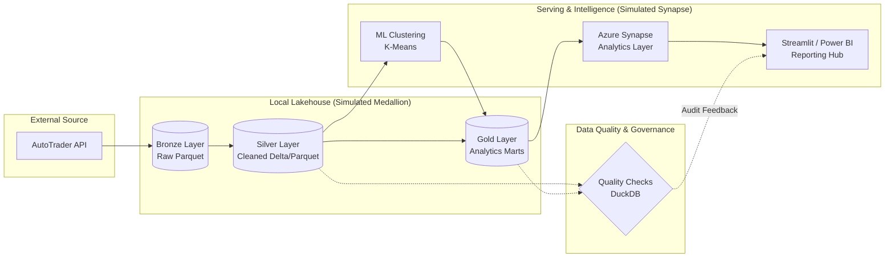
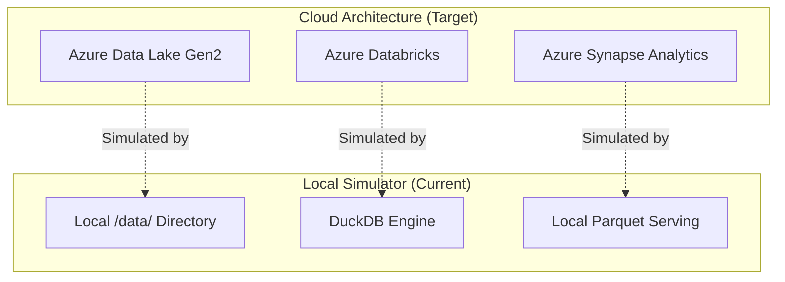

This project is a high-performance **Local Lakehouse Analytics Pipeline** designed to track the impact of London's Ultra Low Emission Zone (ULEZ) on the used car market. 

Originally designed for a **Cloud-Native Architecture (Azure Databricks + Azure Synapse)**, this version has been refactored into a **"Pure Lakehouse Simulator"** to allow for 100% local, cost-free execution. The project focuses on the **Delivery of reliable, scalable and well-governed data pipelines** that meet business requirements in a simulated regulated environment.

---

## 🏗️ Architecture: The Medallion Model
The project follows the industry-standard Medallion Architecture using **Parquet** files and **DuckDB** for lightning-fast SQL processing:



| Layer | Type | Physical Path | Description |
| :--- | :--- | :--- | :--- |
| **Bronze** | Raw Parquet | `data/bronze/*.parquet` | Immutable source data from AutoTrader API. |
| **Silver** | Cleaned Table | `data/silver/fct_cars.parquet` | Validated, type-casted, and de-duplicated transactional records. |
| **Gold** | Analytics Mart | `data/gold/mart_*.parquet` | Aggregated insights for Market Impact and Diesel Devaluation. |
| **Diagnostics**| Audit Metadata | `data/diagnostics/quality_audit.parquet` | Historical QA results for platform stability monitoring. |

1.  **Bronze (Raw)**: Ingests live data from the AutoTrader API via a Python collector. Data is stored in raw Parquet format with ingestion timestamps.
2.  **Silver (Curated)**: Deduplicates data, standardizes schemas, and applies **ULEZ Compliance Logic** (Petrol >= 2006, Diesel >= 2015).
3.  **Gold (Aggregated)**: Business-level marts including "Market Impact Index" and "Diesel Devaluation Rankings".
4.  **Intelligence**: A K-Means Clustering model (Scikit-Learn) that segments the market into Premium, Standard, and Budget profiles.

---

## 🛠️ Simulation Logic & Strategic Decisions

### Why DuckDB instead of Spark?
While the original project utilized PySpark for Databricks, this simulator uses **DuckDB**. 



- **Reasoning**: DuckDB provides the same analytical SQL power as Spark/Synapse but runs locally with **zero external dependencies**. 
- **Business Alignment**: This simulator ensures the **availability of trusted, high-quality Gold-layer datasets** optimized for analytics consumption (simulated Power BI reporting via Streamlit).

### The "Cloud-Ready" Nature
The logic in `databricks_pipeline.py` is written to be easily portable. If you move these files to an actual Azure Data Lake, you simply swap the local paths for `abfss://` paths, and the SQL logic remains largely the same.

---

## 🛡️ Enterprise-Grade Features

### 1. Automated Quality Assurance (QA)
- **Script**: `05_quality/quality_checks.py`
- **Logic**: Implements automated data validation using DuckDB. It checks for Primary Key integrity, price consistency, and validates business logic (ULEZ compliance rules) before data reaches the Gold layer.

### 2. Data Governance & Metadata
- **Repository**: `docs/METADATA_CATALOG.md`
- **Deliverable**: A comprehensive Data Dictionary and Semantic Model definition. Demonstrates experience in maintaining metadata repositories and documenting data lineage.

### 3. Continuous Integration & Release Engineering
- **Workflow**: `.github/workflows/data_pipeline_ci.yml`
- **Governance**: Adheres to **data security and governance standards** by automating linting, testing, and quality stubs on every release.

### 4. Operational Stability & Support
- **Logs**: Centralized logging in `logs/pipeline.log`.
- **Runbook**: Detailed **Operational Run Books** (`docs/OPERATIONAL_RUNBOOK.md`) for effective resolution of pipeline incidents with clear root-cause understanding.

---

### Limitations
- **Volume**: Being a local simulator, it is designed for thousands of records rather than petabytes.
- **Hardware**: Reliability depends on local SSD performance rather than cloud-managed clusters.
- **Connectivity**: This version eliminates Snowflake to avoid cloud costs, using Local Parquet as the final "Serving Layer" for the Streamlit Dashboard.

---

## 🚀 How to Run Locally

### 1. Requirements
Ensure you have Python 3.9+ installed.
```bash
pip install -r requirements.txt
```

### 2. Execution Sequence
Follow the pipeline order:
1.  **Ingestion**: `python 01_ingestion/data_engine.py` (Gathering API data)
2.  **Processing**: `python 02_processing/databricks_pipeline.py` (Building the Lakehouse)
3.  **Intelligence**: `python 02_processing/ml_clustering.py` (Market Segmentation)
4.  **Quality Check**: `python 05_quality/quality_checks.py` (Automated QA)
5.  **Dashboard**: `streamlit run 04_visualization/app/app.py`

---

## 📊 Dashboard Preview
The dashboard provides a **Premium Light Mode** interface featuring:
- Live Price Gap analysis between compliant and non-compliant vehicles.
- Top 10 Diesel Devaluation ranking.
- Interactive ML Market Clusters (Price vs Mileage).

---
*Created as an advanced simulation for Data Engineering and Market Analytics.*
