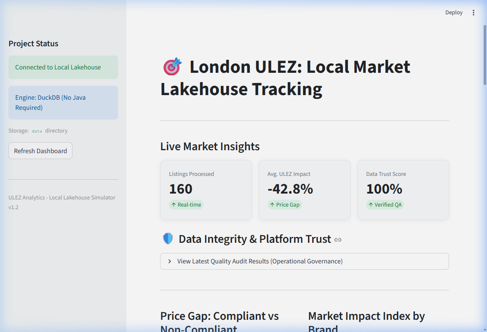
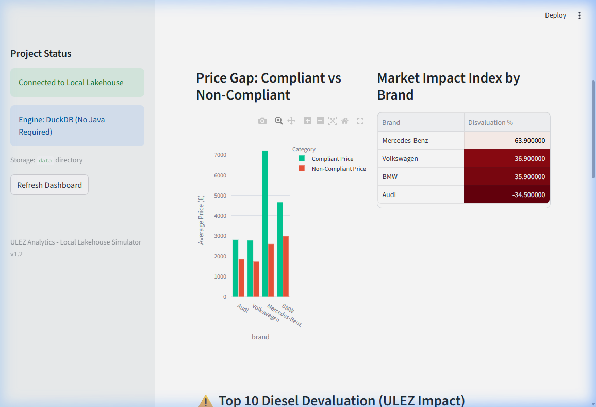
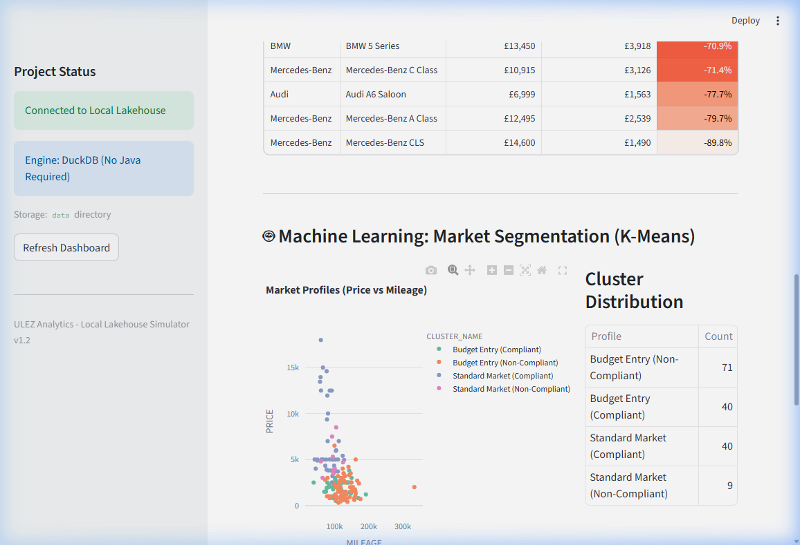
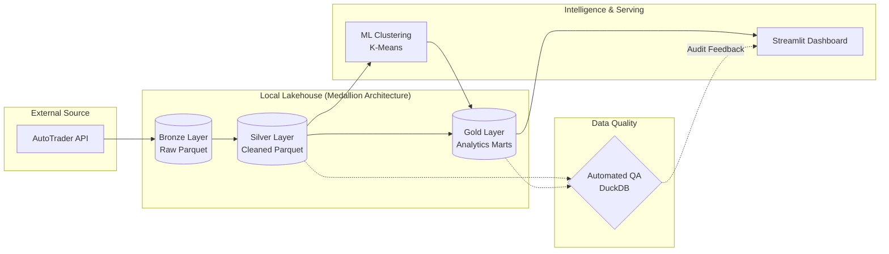
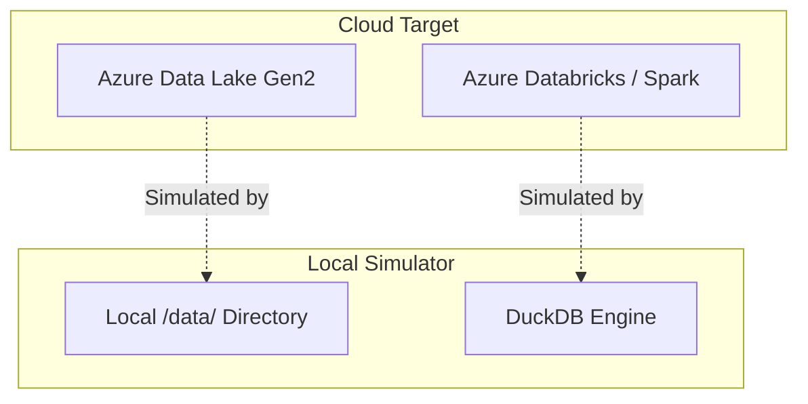

# ULEZ Market Analytics — Local Lakehouse

A local Lakehouse pipeline that analyses the UK **ULEZ (Ultra Low Emission Zone)** policy's impact on second-hand car prices, using live data from the AutoTrader API.

Built using the **Medallion Architecture** (Bronze → Silver → Gold) with **DuckDB** for analytical SQL processing and **Parquet** for storage. The pipeline logic is written to be cloud-portable — swap local file paths for `abfss://` URIs and it runs on Azure Databricks/Spark with minimal changes.

---

## 📊 Dashboard Preview







---

## 🏗️ Architecture: Medallion Model



| Layer | Physical Path | Description |
| :--- | :--- | :--- |
| **Bronze** | `data/bronze/*.parquet` | Immutable source data from AutoTrader API with ingestion timestamps. |
| **Silver** | `data/silver/fct_cars.parquet` | Validated, type-casted, and de-duplicated records with ULEZ compliance flags. |
| **Gold** | `data/gold/mart_*.parquet` | Aggregated analytics marts: Market Impact, Diesel Devaluation, ML Clusters. |
| **Diagnostics** | `data/diagnostics/quality_audit.parquet` | Historical QA audit results (last 100 runs). |

### Pipeline Stages
1. **Bronze (Raw)**: Ingests live data from the AutoTrader API. Data is stored in raw Parquet with ingestion timestamps.
2. **Silver (Curated)**: Deduplicates records, standardises schemas, and applies ULEZ Compliance Logic (Petrol ≥ 2006, Diesel ≥ 2015).
3. **Gold (Aggregated)**: Business-level marts including Market Impact Index and Diesel Devaluation Rankings.
4. **ML Segmentation**: K-Means clustering with automated K selection via silhouette scoring to segment the market into profiles.

---

## 🛠️ Design Decisions

### Why DuckDB Instead of Spark?



DuckDB provides analytical SQL parity with Spark/Synapse but runs locally with zero infrastructure cost. The SQL in `databricks_pipeline.py` is written to be portable — replacing local paths with `abfss://` URIs is the primary change needed for cloud deployment.

### Cloud Portability
The Medallion layer logic (Bronze → Silver → Gold) is engine-agnostic by design:
- **SQL transformations** use standard ANSI SQL compatible with both DuckDB and Spark SQL.
- **Parquet storage** is the same format used by Azure Data Lake, Delta Lake, and most cloud data platforms.
- **ULEZ business rules** are applied in the Silver layer where they belong in any lakehouse architecture.

---

## 🛡️ Operational Features

### Automated Quality Assurance
- **Script**: `05_quality/quality_checks.py`
- **Checks**: Primary Key integrity, price accuracy, ULEZ compliance logic validation, Gold metrics completeness.
- **Audit Trail**: Results persisted to `data/diagnostics/quality_audit.parquet`.

### Data Governance & Metadata
- **Data Dictionary**: `docs/METADATA_CATALOG.md` — column definitions, semantic rules, and data types for every layer.
- **Data Lineage**: `docs/DATA_LINEAGE.md` — end-to-end data flow documentation.

### CI/CD
- **Workflow**: `.github/workflows/data_pipeline_ci.yml`
- **Pipeline**: Linting (ruff) → Unit tests (pytest) → Quality gate on every push to `main`.

### Logging & Monitoring
- **Centralized logs**: `logs/pipeline.log` with structured timestamps and severity levels.
- **Row-count guardrails**: Pipeline aborts if Silver layer produces zero rows (prevents empty Gold marts).
- **Operational Runbook**: `docs/OPERATIONAL_RUNBOOK.md` — incident response procedures and release checklist.

---

## 📋 Known Limitations & Production Roadmap

### Current Limitations
- **Full refresh only** — no incremental load or CDC strategy. Each run reprocesses all Bronze data.
- **Local scale** — designed for thousands of records, not petabyte workloads.
- **Single-threaded** — brands are processed sequentially, not in parallel.

### Production Migration Path
1. Replace local `data/` paths with `abfss://` Azure Data Lake Gen2 URIs.
2. Swap DuckDB for Spark SQL on Databricks — SQL logic is compatible.
3. Add incremental loads using `ingestion_timestamp` as a watermark column.
4. Implement secret management via Azure Key Vault.
5. Schedule via Databricks Workflows or Apache Airflow.

---

## 🚀 How to Run Locally

### 1. Requirements
Ensure you have Python 3.9+ installed.
```bash
pip install -r requirements.txt
```

### 2. Execution Sequence
```bash
# 1. Ingest live data from AutoTrader API
python 01_ingestion/data_engine.py

# 2. Build the Lakehouse (Bronze → Silver → Gold)
python 02_processing/databricks_pipeline.py

# 3. Run ML market segmentation
python 02_processing/ml_clustering.py

# 4. Validate data quality
python 05_quality/quality_checks.py

# 5. Launch the dashboard
streamlit run 04_visualization/app/app.py
```

---

## 📂 Project Structure
```
├── 01_ingestion/          # API data collection
│   ├── autotrader_collector.py
│   └── data_engine.py
├── 02_processing/         # Medallion pipeline + ML
│   ├── databricks_pipeline.py
│   └── ml_clustering.py
├── 04_visualization/      # Streamlit dashboard
│   └── app/app.py
├── 05_quality/            # Automated QA suite
│   └── quality_checks.py
├── tests/                 # Unit tests
├── docs/                  # Metadata catalog, lineage, runbook
├── .github/workflows/     # CI/CD pipelines
└── logs/                  # Pipeline execution logs
```
