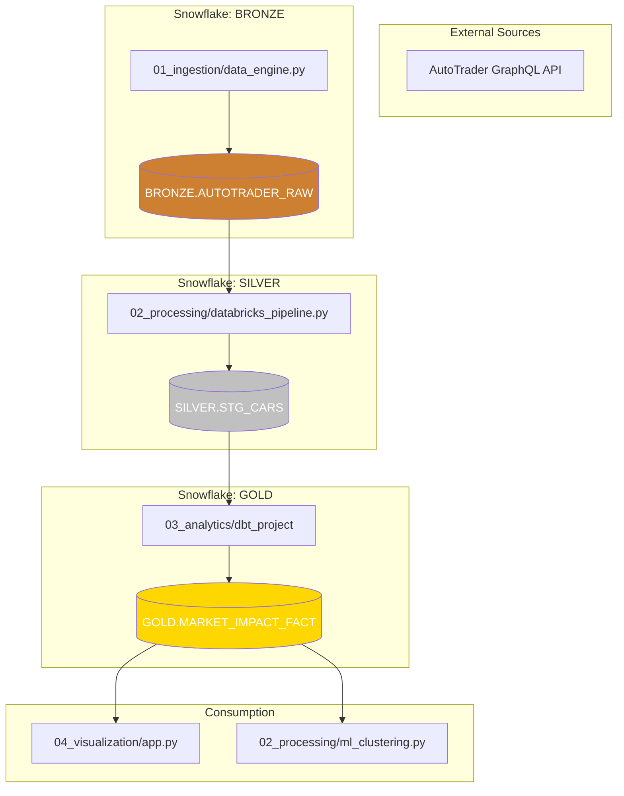

# ⛓️ Data Lineage: ULEZ Databricks & Snowflake

This document tracks the flow of data from source extraction to final analytical consumption.

| Folder | Component | Logic Summary | Engine |
| :--- | :--- | :--- | :--- |
| **01_ingestion** | `data_engine.py` | API fetching and direct Snowflake ingestion. | Python |
| **02_processing** | `databricks_pipeline.py` | ULEZ Compliance mapping and data cleaning. | PySpark (AWS) |
| **03_analytics** | `dbt models` | Final Star Schema and Star modeling. | dbt (Snowflake) |
| **04_visualization** | `app.py` | Market impact dashboard. | Streamlit |
