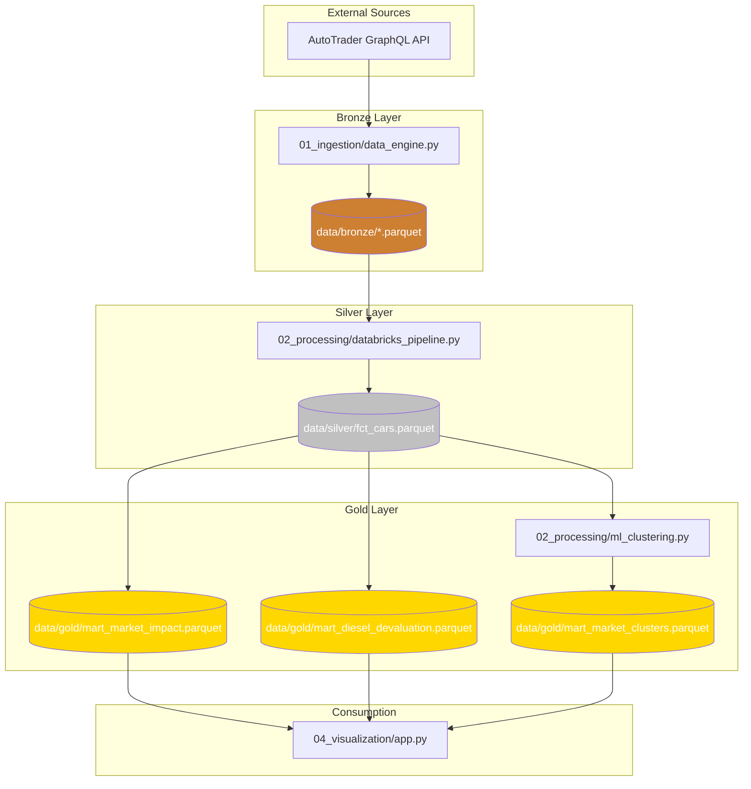

# ⛓️ Data Lineage: ULEZ Lakehouse Pipeline

This document tracks the flow of data from source extraction to final analytical consumption.

| Folder | Component | Logic Summary | Engine |
| :--- | :--- | :--- | :--- |
| **01_ingestion** | `data_engine.py` | API fetching, saves raw Parquet to Bronze layer. | Python + Pandas |
| **02_processing** | `databricks_pipeline.py` | ULEZ compliance mapping, deduplication, cleaning. | DuckDB SQL |
| **02_processing** | `ml_clustering.py` | K-Means market segmentation with silhouette evaluation. | Scikit-Learn |
| **04_visualization** | `app.py` | Market impact dashboard. | Streamlit + Plotly |
| **05_quality** | `quality_checks.py` | Automated QA: PK integrity, price accuracy, ULEZ logic. | DuckDB SQL |
